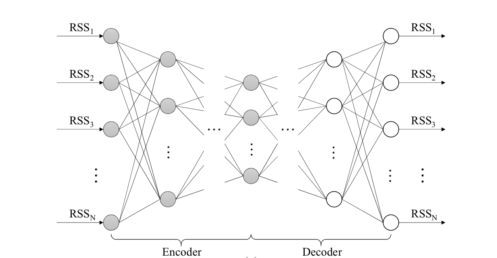
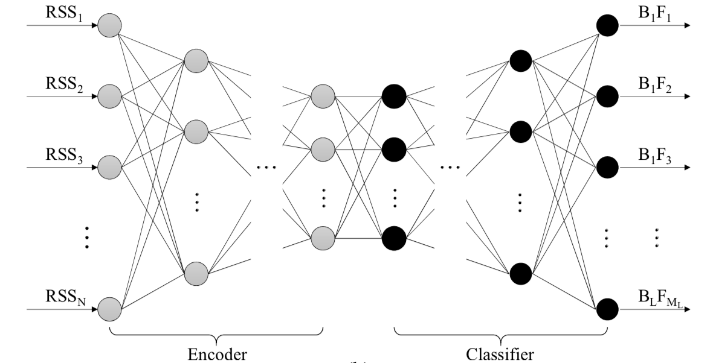
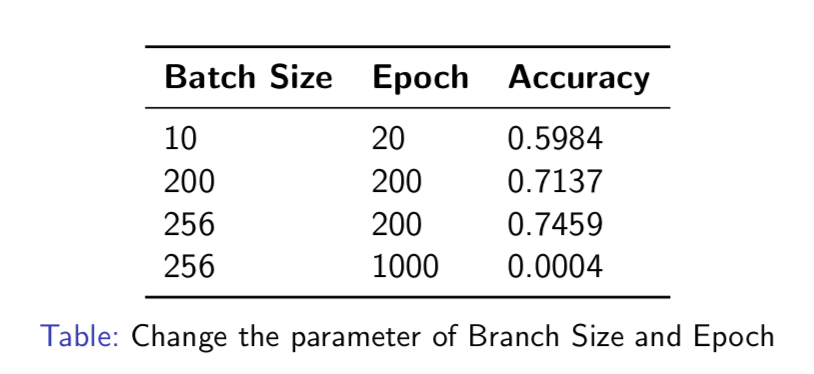
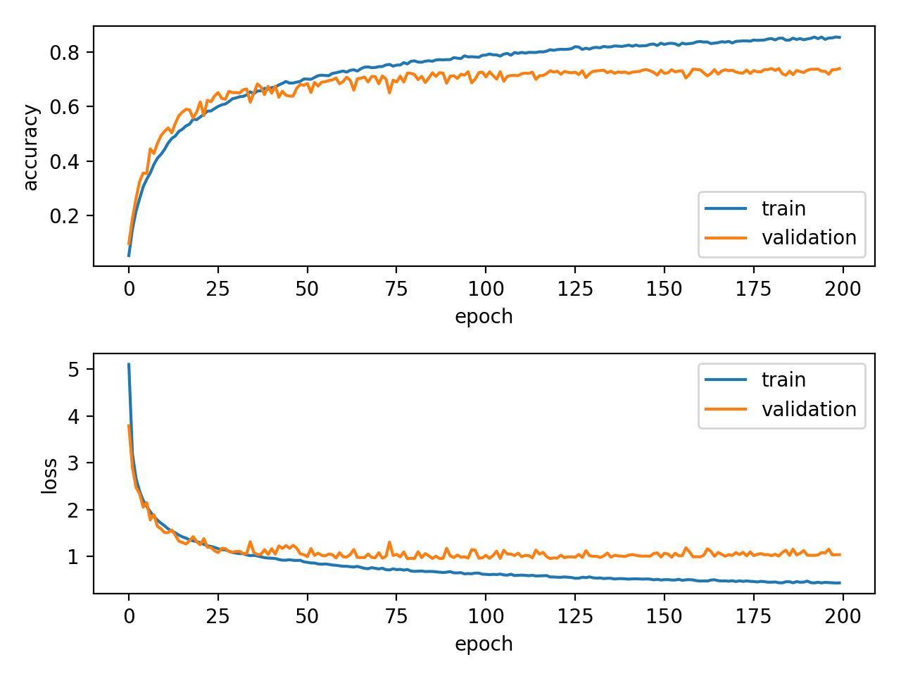
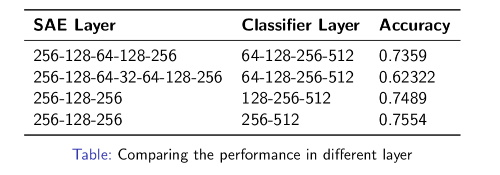
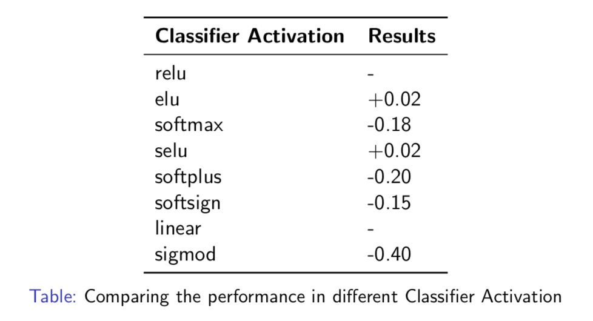
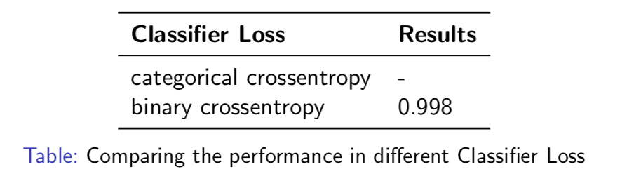
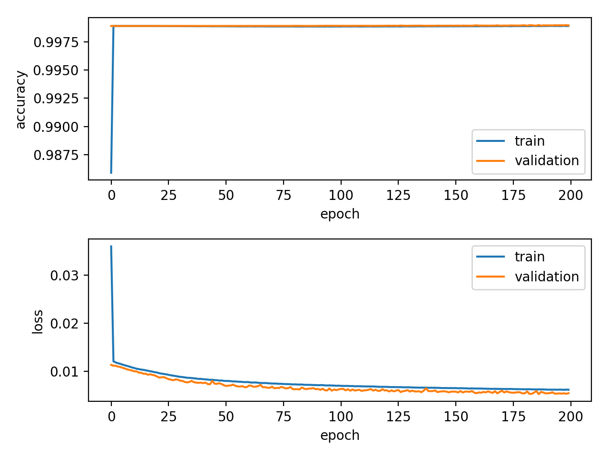
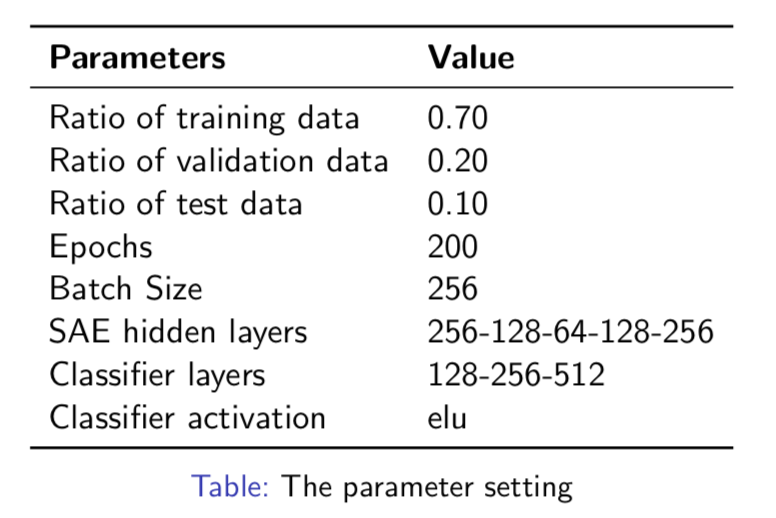

# Building/Floor Classification and Location Estimation using WiFi Signals
***
#### **EEE413 Term Project: Indoor localization**
**Professor:** Dr.Kyeong Soo Kim (Joseph)  
**Student:** Yupeng Cao, 1302533

#### Catalogue
* Introduction
* Methodology
* Optimizing Logically
* Results and Discussions 
* Conclusions

## Introduction
### Background
Indoor Localization is a challenging task and there exist no universal solution for all possible applications.

External infrastructure is efficient for localization in limited areas. In large buildings the most precise agent's pose estimates are obtained with laser scanners, however laser scabbers are expensive.

WiFi information can be exploited to provide rough, global position estimates, without additional costs of exteroceptive sensors.

### Related Work
**WiFI Ranging:** the properties of WiFi signal wave are exploited to directly estimate the distance to the access points.

**WiFi Fingerprinting:** Focus on efficiently comparing achieved WiFi scans to the prerecorded database of scans inside building and thus are more robust to local signal disturbances.

**k Nearest Neighbors:** k scans that are the most similar to the analyzed WiFi scan are queried from the database and their positions are averaged to achieve the position estimate.

### Motivation
Those solutions are difficult to tune in a case of a larger building and if a large amount of data is available.

However, the growing amount of available date is caused by the popularity if mobile devices equipped with WiFi adapters.Therefore, machine learning approaches are a promising solution due to less parameter tuning and better scalability in larger environments.GPU processing capabilities improving also can rise the performance.

This project propose DNN approach for floor and building classification and location. We find that in certainly range adjusting two parameter can improve the performance.

## Methodology
We propose a classification DNN with autoencoders to predict floor and building based on a single scan.


The figure shows the SAE Model. 

The system can capture muhc signal strength measurements for APs available in its vicinity, but only a subset of a total number of networks in the environment are abserved. Stacked autoencoders (SAE) can help us to reduce redundancy records and provides the simplification higher level features for machine learning approach, which also the inpit data during unsupervised training.

The figure shows the Classifier Training Model.

When the unsupervised learning of SAE is finished, typical fully-connected layers of a deep network ae connected to the output of the encoder. The exemplary classifier part consists of two hidden layers. The final output layer is a softmax layer that outputs the probabilities of a current sample belonging to analyzed classes. 


##Optimizing Logically
Before we modify the Training Model, we want to try to adjust some key parameters to improve the accuracy first. Based on coding, we choose those parameters from three aspects to test.
Thus, we choose some key parameter to optimize to try to improve the performance:

* Batch Size and Epoch times
* SAE layer and Classifier layer
* Classifier Activation


## Results and Discussions 
* **Batch Size and Epoch times**



Incresing Epoch value can increasing training times.
Adjusting batch size can change the data size of pre-processing. And the batch size equals to 256 (match with data size of the SAE layers), the opoch equals to 200. If the training times too large to get the normal accuracy, because it happened overfitting.

* **SAE layer and Classifier layer**

Based on the Branch Size and Epoch result, the next step is trying to modify the number of the layer of classifier.


Although remove the number of the layer can get better perfromance, this operation will change the model to sample. Thus, we didn't choose this method to optimize accuracy. 

* **Classifier Activation**

Classifier Activation is also an important parameter, therefore we try to optimize it.



Elu and selu Classifier activation are the better parameter.

* **Classifier Loss**

What’s more, we have some interesting result when we try to improve the performance by changing classifier loss.



From the figure, we find that the model looks like skip to the training process. Based on this result, we read some article and we find that "Binary Crossentropy" usually used in multi-lable. 

**Here is the finally parameter setting which we settle done**



```
Final Parameter Setting
+#+STARTUP: showall
* System parameters
  - Numpy random number seed: 0
  - Ratio of training data to overall data: 0.70
  - Ratio of validation data to overall data: 0.20
  - Ratio of test data to overall data: 0.10
  - Number of epochs: 200
  - Batch size: 256
  - SAE hidden layers: 256-128-64-128-256
  - SAE activation: tanh
  - SAE bias: False
  - SAE optimizer: adam
  - SAE loss: mse
  - Classifier hidden layers: 128-256-512
  - Classifier hidden layer activation: selu
  - Classifier bias: False
  - Classifier optimizer: adagrad
  - Classifier loss: categorical_crossentropy
  - Classifier dropout rate: 0.20
* Performance
  - Loss = 1.296600e+00
  - Accuracy (overall): 7.555781e-01

```


## Conclusions
* The accuracy can get the 75.56%
* However, improving the performance by modifying the parameters is limitation.
* In the future: totally understanding the model and code; Try to modify the model; Adding kNN into whole process;Increasing the number of the data
* Learning Point: Good starting point in Artificial Intelligence; Learning some basic knowledge about Neural Network and Deep Learning


## Reference  
<sup><a id="fn.1" class="footnum" href="#fnr.1">1</a></sup> M. Nowicki and J. Wietrzykowski, "Low-effort place recognition with WiFi fingerprints using deep learning," arXiv:1611.02049v2 [cs.RO] [(arXiv)](https://arxiv.org/abs/1611.02049v2)

<sup><a id="fn.2" class="footnum" href="#fnr.2">2</a></sup> T. Yamashita et al., "Cost-alleviative learning for deep convolutional neural network-based facial part labeling," *IPSJ Transactions on Computer Vision and Applications*, vol. 7, pp. 99-103, 2015. [(DOI)](http://doi.org/10.2197/ipsjtcva.7.99)

<sup><a id="fn.3" class="footnum" href="#fnr.3">3</a></sup> Kyeong Soo Kim, Ruihao Wang,et al.(Oct,2017) "Large-Scale Location-Aware Services in Access: Hierarchical Building/Floor Classification and Location Estimation using Wi-Fi Fingerprinting Based on Deep Neural Networks."arXiv:1710.00951v3[(arXiv)](https://arxiv.org/abs/1710.00951)

<sup><a id="fn.4" class="footnum" href="#fnr.4">4</a></sup> 
GitHub Link: https://github.com/kyeongsoo/indoor_localization

## End
